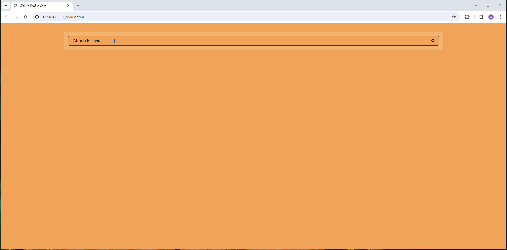

Project Overview:

Welcome to the GitHub Card project! This tool allows you to create visually appealing GitHub profile cards that you can embed in your README or other markdown documents.
I appreciate the GitHub API for making it possible to create dynamic and interactive profile card.
Developed using HTML5, CSS3, and JAVASCRIPT. 

Extternal Library;

Google Fonts,

Font Awesome.

<h1>GITHUB-PROFILE-CARD</h1>

 
  
<h3>How to Use</h3>

1. Download or clone the project files.
2. Open the `index.html` file in a web browser to view the website.
3. 
<h3>Features</h3>

Customizable Cards:

Personalize your GitHub card by choosing from various styles, themes, and information to display.

Real-time Preview:

See the changes in real-time as you customize your card. Experiment with different options until you find the perfect look.

Easy Integration:

Simply copy the generated markdown code and paste it into your GitHub README or any markdown-supported platform.
If you have any questions or suggestions, feel free to contact me at 

[gkarakaya0601@gmail.com].

